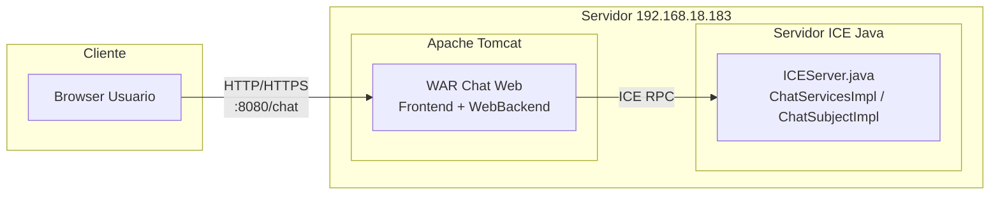

# Multiple Client Hub — Chat (ZeroC ICE + Java backend + cliente web)

## Equipo

-   Samuel Gallego
    
-   Anderson Romero
    
-   Daniel Martínez
    
-   David Chicué
    

## Resumen (versión actual del proyecto)

Esta versión del proyecto migra el backend de un modelo basado en sockets TCP y proxy HTTP hacia una arquitectura apoyada en ZeroC ICE para la comunicación remota entre el servidor Java y los clientes. El objetivo es disponer de un sistema de chat extensible con soporte para mensajería, grupos, audio de alta calidad y llamadas tipo streaming, manteniendo un cliente web moderno empaquetado con Webpack.

Estructura Actual del proyecto
Perfecto, aquí tienes la **estructura relevante** adaptada a tu nuevo proyecto (ZeroC ICE, Java backend, cliente web, sin Node/Express) y el resumen de qué hace cada archivo/carpeta principal del workspace que muestras en tus capturas.

----------

## Estructura relevante (resumen)

---

  

## Estructura relevante (resumen)

  

```
src/
├── chat_history/                      # Almacenamiento de historiales de chat privado en archivos
│   ├── private_user1_user2.txt        # Mensajes privados entre pares de usuarios (persistente)
│   └── ...
├── groups_data/                       # Persistencia de datos de los grupos creados
│   └── groups.txt                     # Estructura y miembros de todos los grupos (persistente)
├── main/java/com/icesi/chatapp/
│   ├── Client/                        # Lógica y utilidades para la capa cliente (Modelo TCP)
│   │   ├── AudioCallReceiver.java     # Recibe audio durante llamadas
│   │   ├── AudioCallSender.java       # Envía audio crudo (PCM) durante llamadas
│   │   ├── AudioPlayer.java           # Reproducción de audio recibido por llamadas
│   │   ├── AudioSender.java           # Remitente de mensajes de audio grabados
│   │   ├── Client.java                # Representación local de usuario (para Modelo TCP)
│   │   └── ClientAudioReceiver.java   # Recibe y procesa stream de audio
│   ├── ICEServices/                   # Implementaciones de los servicios ICE definidos en Chat.ice
│   │   ├── ChatServicesImpl.java      # Implementa lógica principal: login, mensajes, grupos, llamadas, vaciado, etc.
│   │   ├── ChatSubjectImpl.java       # Implementa callbacks/eventos para notificaciones en tiempo real
│   │   └── ICEServer.java             # Inicializa comunicador ICE, registra objetos y adapta endpoints
│   ├── Server/                        # Backend clásico (persistencia y lógica "de bajo nivel")
│   │   ├── ClientHandler.java         # Orquesta la conexión del cliente con el backend (TCP)
│   │   ├── Database.java              # Maneja acceso directo a datos: guarda y recupera estados persistentes
│   │   ├── GroupsStorage.java         # Gestor específico para persistencia/edición de grupos
│   │   ├── MessageHistory.java        # Lectura/escritura sincronizada de historiales en archivos
│   │   └── Server.java                # Entrada alternativa (TCP/HTTP)
├── Chat.ice                           # Definiciones de interfaces ICE: usuarios, grupos, mensajes, audio, eventos
└── web-client/                        # Cliente web moderno (Webpack, React, módulos)
    ├── dist/                          # Bundle y assets finales listos para producción/despliegue
    ├── extLibs/                       # Librerías externas/fuentes complementarias
    ├── node_modules/                  # Dependencias JS/NPM instaladas
    └── src/
        ├── components/                # Componentes reutilizables de UI (burbujas, listas, toasts, modales...)
        ├── pages/
        │   ├── ChatApp.js             # Maneja estado principal, mensajes, grupos, audio, llamadas, toasts, reply, etc.
        │   └── Home.js                # Vista de inicio, login y ruta hacia ChatApp
        ├── router/
        │   ├── Router.js              # Lógica de ruteo (controla navegación entre vistas)
        │   └── routes.js              # Mapa de rutas y vistas asociadas
        └── services/
            └── chatService.js         # Abstracción de comunicación HTTP/WebSocket con backend: login, mensajes, grupos, audio...
    ├── index.html                     # Estructura base e inclusión de bundles/scripts
    ├── index.js                       # Entrypoint JS, inicializa cliente y router
    ├── index.css                      # Hoja de estilos global Responsive
    ├── package.json                   # Configuración de dependencias y scripts de NPM
    ├── package-lock.json              # Versión exacta de las dependencias
    ├── webpack.config.js              # Configuración Webpack: entradas, salidas, dev server, proxies, etc.
├── build.gradle                       # Configuración de build Gradle para backend Java y WAR
├── ice.properties                     # Configuración de ICE: endpoints, puertos, timeouts, etc.
```


----------

## ¿Qué hace cada cosa?

## Backend Java (`main/java/com/icesi/chatapp`)

-   **ICEServices/**
    
    -   `ChatServicesImpl.java`: Implementa toda la lógica principal del chat: manejo y validación de usuarios, envío de mensajes privados/de grupo, audio, llamadas de voz, reply, vaciado y recuperación de historiales, etc.
        
    -   `ChatSubjectImpl.java`: Se encarga de emitir eventos a los clientes conectados (notificaciones tipo toast: usuario conectado, grupo creado, mensaje nuevo, cambios de miembros).
        
    -   `ICEServer.java`: Configuración y arranque del servidor ICE: crea el objeto adaptador, expone los servicios y establece los endpoints configurados en `ice.properties`.
        
-   **Server (Abstracción para manejo TCP/HTTP con Express)/**
    
    -   `ClientHandler.java`: Encapsula el manejo de sesión y vida de cada cliente en el backend.
        
    -   `Database.java`: Encargado de acceso persistente a los datos estructurados del sistema (usuarios, grupos, mensajes).
        
    -   `GroupsStorage.java`: Persiste y recupera información de los grupos y sus miembros.
        
    -   `MessageHistory.java`: Lee y escribe los historiales de chat (privado y de grupo) en archivos según usuario/contexto.
        
    -   `Server.java`: Punto de entrada alternativo; posible uso para debugging TCP directo.
        
-   **Client (Tarea 1 - TCP/UDP por consola)/**
    
    -   Módulos para simulación o utilidades internas relacionadas con audio, como envío/recepción de PCM y reproducción de datos de audio y llamadas.
        

## Definición ICE

-   **Chat.ice**  
    Define la interfaz **remota** (qué operaciones pueden ser llamadas vía ICE):
    
    -   Login, registro de usuarios
        
    -   Creación y administración de grupos
        
    -   Envío de mensajes, audio y eventos
        
    -   Vaciar/recuperar historiales
        
    -   Interfaces de callback para las notificaciones “push” (eventos para los toasts, etc.)
        

## Persistencia en archivos

-   **chat_history/**  
    Archivos de texto que guardan el historial de chat privado (uno por par de usuarios).
    
-   **groups_data/**  
    Archivo que almacena la estructura y miembros de los grupos persistentes.
    

## Cliente Web (`web-client/src`)

-   **services/chatService.js**  
    Encapsula todas las llamadas desde la UI al backend HTTP/WebSocket.  
    Expone funciones como:
    
    -   `login()`, `sendMessage()`, `createGroup()`, `addMember()`, `removeMember()`, `replyMessage()`, `sendAudio()`, `startCall()`, `clearChat()`, etc.
        
-   **pages/**
    
    -   `Home.js`: Vista inicial de login/registro y navegación hacia el chat.
        
    -   `ChatApp.js`: Componente principal: muestra mensajes, maneja notificaciones, lógica de reply, llamadas, grupos, vaciado de chat, etc.
        
-   **router/**
    
    -   `Router.js`: Lógica para alternar vistas (p.ej., de Home a ChatApp según el estado o rutas).
        
    -   `routes.js`: Define las rutas principales y qué vista/components debe renderizar.
        
-   **components/**
    
    -   Elementos visuales para UI, como la lista de miembros, burbujas de mensaje, panel de reply, toasts, controles de audio, etc.
        
-   **index.html, index.js, index.css**
    
    -   Entrypoint HTML (estructura base).
        
    -   Entrypoint JS (arranque y ruteo de la app).
        
    -   Estilos globales de diseño responsivo.
        
-   **webpack.config.js**
    
    -   Configura cómo Webpack crea los bundles, gestiona assets y activa el servidor de desarrollo.
        
----------

## ¿Qué es ZeroC ICE y cómo se usa en el proyecto?

ZeroC ICE (Internet Communications Engine) es un middleware RPC orientado a objetos que facilita la comunicación entre aplicaciones distribuidas, permitiendo definir interfaces en archivos `.ice` y generar stubs/proxies fuertemente tipados para múltiples lenguajes. En este proyecto:

-   Se define el contrato del sistema de chat en `Chat.ice`, incluyendo servicios para usuarios, grupos, mensajes y audio.
    
-   El servidor Java implementa estas interfaces (`ChatServicesImpl.java`, `ChatSubjectImpl.java`, `ICEServer.java`), registrándolas en un adaptador de objetos ICE.
    
-   El cliente web se comunica con un backend expuesto en HTTP/WebSocket que actúa como puente hacia ICE, o con un proxy local que encapsula las llamadas ICE según la configuración del entorno.
    

Diagrama mermaid de alto nivel de la comunicación basada en ICE:
- 
- Diagrama de Secuencias:


- Diagrama de Componentes (Componentes Actuales del Proyecto)

```mermaid
  flowchart  LR

subgraph  FE["Frontend - Browser JS"]

UI["Chat GUI (ChatApp.js)"]

ROUTER["Router (routes.js)"]

CS["ChatService wrapper (chatService.js)"]

AUDIO["Audio Player + PCM Engine (Web Audio + blobs)"]

end

subgraph  BE["Backend - Java ICE"]

ICECORE["Ice Runtime (Communicator, Proxies)"]

SVC["ChatServicesImpl (ChatService)"]

SUBJ["ChatSubjectImpl (Subject + observers)"]

MH["MessageHistory (files: text + audio)"]

GRP["GroupsStorage / in-mem groups"]

end

subgraph  FS["Filesystem"]

TXT["chat_history/*.txt"]

AUD["audio_history/*.webm"]

GRPFILE["groups_data/groups.txt"]

end

ROUTER  -->  UI

UI  -->  CS  &  AUDIO

CS  -->  UI

CS  <-->  ICECORE

ICECORE  -->  SVC  &  SUBJ

SVC  -->  MH  &  GRP

SUBJ  -->  SVC

MH  -->  TXT  &  AUD

GRP  -->  GRPFILE
  ```

-   El **frontend** maneja interacción de usuario, audio y comunicación con backend, estructurado en componentes independientes pero bien comunicados.
    
-   El **backend (Java ICE)** recibe, procesa y persiste información, implementa toda la lógica de negocio y dispara notificaciones usando el patrón observer.
    
-   El **filesystem** sirve como base para almacenar mensajes, audios y datos de grupos, asegurando persistencia.
    
-   Toda esta arquitectura, gracias a ICE y Slice, es modular, desacoplada, escalable y fácil de extender o portar.
    
----------

## ¿Qué son las definiciones Slice en ZeroC ICE?

**Slice** (Specification Language for ICE) es el lenguaje que se usa para definir las interfaces, estructuras y tipos de datos que forman el “contrato” entre cliente y servidor.

-   Permite describir _qué operaciones_ (métodos) pueden llamarse remotamente, _qué argumentos_ reciben y _qué tipos de datos_ intercambian.
    
-   Es **independiente del lenguaje de programación**. Por ejemplo, defines las operaciones en Slice y puedes generar código para Java, Python, C++… etc.
    
-   El archivo `.ice` es como el corazón de la comunicación: lo que declares ahí será la base para los stubs/proxies que generan y entienden ambos extremos.​
    

**Ejemplo conceptual de Slice:**

text
```
module ChatApp {  
    interface ChatService { 
        void login(string username); 
        void sendMessage(string sender, string receiver, string text); 
        void createGroup(string groupName, string[] members); // ...más métodos 
        } 
} 
```

Esto representa la “API remota”. ICE genera el código necesario para que cliente y servidor puedan comunicarse usando esas operaciones y tipos, independientemente del lenguaje y la plataforma.

**Ventajas:**

-   Separación nítida entre lo que “ofrece” el servicio y cómo está implementado.
    
-   Puedes cambiar la lógica interna del servidor sin modificar el contrato con los clientes, mientras mantengas las mismas firmas Slice.
    

----------

## Patrón Observer en ICE en el proyecto

El **patrón Observer** (observador/publicador-suscriptor) es fundamental en sistemas donde muchos clientes deben recibir “notificaciones” automáticas al ocurrir algo relevante en el servidor (por ejemplo, cuando llega un mensaje nuevo, un usuario se conecta, se crea un grupo, etc.).

**¿Cómo se consigue el patrón Observer con ICE?**

-   En **Slice** defines una interfaz para _callbacks_ o notificaciones, por ejemplo:
    
    ```
    interface ChatNotifications {  
    void messageReceived(string from, string text); 
    void userOnline(string username); 
    void groupCreated(string groupName); 
    }
    ```
    
-   Cada cliente implementa su versión de esa interfaz y la _registra_ en el servidor.
    
-   El servidor guarda los “observadores” suscritos y les llama sus métodos cuando ocurre un evento.
    
-   Así, los clientes reciben _push_ de información relevante en tiempo real.
    

**En el proyecto:**

-   La clase `ChatSubjectImpl.java` , mantiene la lista de clientes suscritos al servidor.
    
-   Cuando ocurre algún _evento_ (nuevo mensaje, usuario entra/sale, evento de grupo), el backend llama a los métodos de _notificación_ de los clientes.
    
-   En la GUI, esto provoca la aparición de **toasts**, el refresco de listas, la actualización inmediata sin polling.
    

**Ventajas del patrón Observer en ICE:**

-   Actualización _realtime_ y eficiente de muchos clientes.
    
-   Bajo acoplamiento: los clientes sólo tienen que implementar el contrato Slice de las notificaciones.
    
-   Escalable: puedes tener decenas de clientes conectados y gestionarlos en paralelo.
    
---

## Arquitectura actual (ICE + GUI)

La arquitectura se organiza en dos grandes bloques: la GUI (cliente web empaquetado con Webpack) y el backend ICE (Java).

```mermaid
graph TD
    subgraph GUI
        A["Home.js"] --> B["ChatApp.js"]
        B --> C["chatService.js"]
        B --> D["Componentes UI (botones, listas, toasts)"]
    end

    subgraph ICE_Backend
        E["ICEServer.java"] --> F["ChatServicesImpl.java"]
        E --> G["ChatSubjectImpl.java"]
        H["Chat.ice"] --> F
        H --> G
    end

    C -->|HTTP/WebSocket| I["Web Backend/Proxy"]
    I -->|RPC ICE| E

  ```


-   GUI:
    
    -   `Home.js`: flujo de login y selección de usuario.
        
    -   `ChatApp.js`: estado principal del chat, mensajes, grupos, audio, llamadas.
        
    -   `chatService.js`: capa de servicios que encapsula llamadas HTTP/WebSocket hacia el backend y la lógica de reconexión/errores.
        
-   ICE Backend:
    
    -   `Chat.ice`: definición de interfaces para usuarios, grupos, mensajes, audio y eventos.
        
    -   `ChatServicesImpl.java`: implementación de operaciones síncronas (login, creación de grupos, obtención de historiales, etc.).
        
    -   `ChatSubjectImpl.java`: manejo de callbacks/eventos hacia los clientes (notificaciones en tiempo real).
        
    -   `ICEServer.java`: punto de entrada del servidor ICE, configuración del comunicador, adaptador y endpoints.
        

----------

## Flujo general de funcionalidades principales

## Flujo de autenticación (ICE)


1.  **Cliente Web → WebBackend:**  
    El usuario ingresa su nombre y la app web envía una petición  `POST /login`  con el username al backend web (probablemente con fetch o axios).
    
2.  **WebBackend → Servidor ICE:**  
    El WebBackend, que sirve de intermediario, toma esa petición y llama (por ICE) al método remoto  `login(username)`. Podría validar el usuario, asignar IDs, chequear duplicidad, etc.
    
3.  **ICE → WebBackend:**  
    El servidor ICE responde: si el login fue exitoso, devuelve los datos necesarios (usuario, sesiones, grupos), si falla envía un error.
    
4.  **WebBackend → Cliente Web:**  
    El backend traduce esta respuesta y envía al frontend la sesión iniciada, junto con la información inicial necesaria para poblar la interfaz (usuarios conectados, grupos a los que pertenece el usuario). 

## Flujo de mensajería privada


1.  **Cliente A → WebBackend:**  
    El usuario A (desde el navegador) envía un mensaje privado a B usando una petición HTTP (ejemplo:  `POST /messages/private`).
    
2.  **WebBackend → IceServer:**  
    El WebBackend toma el contenido y usa el método ICE  `sendPrivateMessage(A, B, msg)`  para realizar la operación en el backend distribuido.
    
3.  **IceServer → WebBackend:**  
    El backend ICE responde primero confirmando que el mensaje fue guardado (ACK) y actualiza el historial de A y B.
    
4.  **IceServer → WebBackend (evento para B):**  
    ICE dispara un evento especial para avisar que B tiene un nuevo mensaje (usando el patrón observer/observer).
    
5.  **WebBackend → Cliente A:**  
    El WebBackend avisa al cliente de A que su mensaje fue entregado correctamente.
    
6.  **WebBackend → Cliente B:**  
    El WebBackend (posiblemente por WebSocket/eventos push) envía una notificación inmediata a B, para que el chat de B se actualice sin que éste tenga que refrescar o consultar el historial a mano.

## Flujo de gestión de grupos


1.  **Cliente Web → WebBackend:**  
    El usuario crea o modifica un grupo desde la interfaz, accionando un botón. Se envía una petición  `POST /groups`  con los datos (nombre, miembros, id si es edición).
    
2.  **WebBackend → IceServer:**  
    El WebBackend reenvía esa operación como llamada remota ICE (`createOrUpdateGroup(...)`). El ICE se encarga de crear o modificar el grupo persistente, actualizando su estructura, miembros, etc.
    
3.  **IceServer → WebBackend:**  
    ICE devuelve el estado nuevo del grupo (confirmación de la acción, lista de miembros final, identificador, posibles errores — si los hay).
    
4.  **WebBackend → Cliente Web:**  
    El Backend web notifica inmediatamente al cliente web el resultado: grupo creado o editado, para que la vista se actualice en tiempo real.

----------

## Nuevos diagramas por funcionalidad

## Botón de Reply (responder mensaje)


Este diagrama explica el flujo cuando el usuario responde a un mensaje concreto.​

-   En la UI, al pulsar el botón “Reply” se guarda una referencia al mensaje original (id del mensaje, autor, hora).
    
-   Cuando se envía el nuevo mensaje,  `chatService.js`  incluye ese  `replyToId`  en el payload.
    
-   El backend ICE guarda el mensaje con el enlace al original, y la GUI lo representa visualmente (por ejemplo, con una tarjeta de respuesta encima del texto).

## Gestión de miembros de grupos (añadir/eliminar)


Este diagrama ilustra cómo se añaden o eliminan miembros desde la vista de grupo.​

-   La UI muestra el panel de miembros del grupo y permite seleccionar usuarios a agregar o quitar.
    
-   `chatService.js`  llama a un método tipo  `modifyGroupMembers`  que envía la diferencia (añadir/eliminar).
    
-   El backend ICE ajusta la estructura del grupo y devuelve el estado actualizado; la interfaz refresca la lista de miembros y lanza toasts informativos.

## Toasts en tiempo real (estado de usuarios y grupos)


Aquí se ve el flujo de eventos de estado (usuario en línea, desconectado, creación de grupos, etc.).​

-   El servidor ICE detecta cambios (login/logout, creación de grupo, cambios de miembros).
    
-   A través del backend web se envían mensajes en tiempo real (por WebSocket o canal equivalente) al navegador.
    
-   El cliente muestra toasts que resumen el evento (“X se ha conectado”, “Grupo Y creado”, “Has sido añadido a Z”).

## Grabación de audio en alta calidad


Este diagrama describe cómo se graban y envían audios con mejor calidad.​

-   La UI invoca  `getUserMedia`  con parámetros de audio de alta calidad (por ejemplo, PCM y mayor sample rate).
    
-   El código de captura acumula los frames de audio en un buffer o blob.
    
-   `chatService.js`  envía ese buffer al backend, junto con metadatos (duración, usuario, destinatario).
    
-   El backend ICE almacena la referencia del audio y lo expone igual que un mensaje, para luego reproducirlo desde la UI.

## Streaming de llamadas de alta calidad (PCM)


Este diagrama representa una llamada de voz en streaming entre dos usuarios.​

-   Un usuario inicia la llamada; el backend ICE notifica al receptor.
    
-   Cuando el receptor acepta, se abre un flujo continuo de chunks PCM entre cliente y servidor.
    
-   Mientras la llamada está activa, el cliente envía continuamente datos de audio crudo y recibe audio del otro extremo, con baja latencia.
    
-   Al colgar, el servidor detiene el flujo y emite el evento de finalización.

## Persistencia de grupos


Aquí se ve la parte de almacenamiento de la configuración de grupos.​

-   Al crear o editar un grupo, la UI envía la solicitud mediante  `chatService.js`.
    
-   El servidor ICE actualiza estructuras en memoria y las persiste (DB, archivos o el mecanismo que tengas).
    
-   Se devuelve al cliente un objeto consistente de grupo (id, nombre, miembros), que puede reconstruirse tras reinicios del servidor.


## Vaciar chat (historial)


Este diagrama muestra el flujo de “Vaciar Chat” (limpiar historiales).​

-   El usuario pulsa “Vaciar Chat” en un chat privado o de grupo.
    
-   `chatService.js`  llama al backend con el contexto (usuario, destino o grupo).
    
-   El servidor ICE borra el historial asociado a ese contexto.
    
-   La UI recarga el listado de mensajes y lo muestra vacío, manteniendo el resto de la aplicación intacta.

----------

## Funcionalidades extra agregadas

Además de la migración a ICE, se han añadido las siguientes funcionalidades:

-   Botón de Reply:
    
    -   Permite responder a un mensaje específico, mostrando la referencia visual al mensaje original en el bubble de la respuesta.
        
    -   El backend registra el identificador del mensaje original para conservar el hilo de conversación.
        
-   Gestión de miembros de grupos (añadir/eliminar):
    
    -   Desde la UI de grupos se pueden añadir nuevos miembros o eliminar existentes.
        
    -   Se actualiza de forma persistente el conjunto de usuarios del grupo en el backend y se notifica a los integrantes mediante toasts.
        
-   Toasts en tiempo real:
    
    -   Notificaciones visuales para eventos de usuario en línea/desconectado, creación/eliminación de grupos, invitaciones y cambios de membresía.
        
    -   Estos toasts se alimentan de eventos de servidor distribuidos a los clientes.
        
-   Grabación de audio en alta calidad:
    
    -   Uso de `getUserMedia` y captura de audio con parámetros de alta calidad (PCM/tasa de muestreo elevada).
        
    -   El audio se envía como blobs/buffers al backend, donde se almacena y luego se reproduce con mejor fidelidad.
        
-   Streaming de llamadas en alta calidad con PCM:
    
    -   Flujo de llamadas de audio tipo streaming, con datos de audio PCM enviados en chunks.
        
    -   El diseño permite latencia baja y buena calidad, sujeto a las restricciones de HTTPS/seguridad del navegador.
        
-   Persistencia de grupos:
    
    -   Los grupos creados quedan almacenados de manera persistente, manteniendo miembros, nombre y estado entre reinicios del servidor.
        
    -   Se exponen operaciones para listar grupos, consultar miembros y eliminar grupos.
        
-   Vaciar chat:
    
    -   Opción desde la UI para vaciar el historial de un chat privado o de grupo.
        
    -   El backend recibe una petición explícita para borrar el historial asociado al contexto.
        
-   Otras mejoras:
    
    -   Manejo de estados de conexión, reconexión y errores de red.
        
    -   Actualización dinámica de listas de usuarios y grupos sin recargar la página.
        
    -   Integración de toasts, badges, indicadores de actividad y manejo de focus en la entrada de texto.
        

----------

## Empaquetado del cliente con Webpack

El cliente web ahora se empaqueta con Webpack para producir un bundle optimizado que incluye:

-   Transpilación y empaquetado de los módulos JavaScript (`ChatApp.js`, `Home.js`, `chatService.js`, componentes de UI, etc.).
    
-   Minificación, tree-shaking y generación de assets para producción.
    
-   Integración con un servidor de desarrollo que facilita hot reload.
    

Durante la configuración de Webpack fue necesario exponer el servicio backend en una IP accesible para el navegador, por ejemplo:

-   Host local configurado como `http://192.168.18.183:8080` en lugar de solo `localhost`.
    
-   Ajustes en `chatService.js` (o archivo de configuración de endpoints) para apuntar a `192.168.18.183` y permitir el consumo desde el frontend empaquetado en el .war desplegado desde Apache Tomcat (LAN).
    
```  
const  hostname  =  '192.168.18.183';
const  port  =  12345;
```

----------

## Despliegue en Apache Tomcat

El proyecto genera un archivo WAR que se despliega en Apache Tomcat:

1.  Construcción del WAR con Gradle.
    
2.  Copia del WAR en el directorio `webapps` de Tomcat.
    
3.  Arranque de Tomcat y acceso a la aplicación desde un navegador usando la URL correspondiente, por ejemplo:  
    `http://192.168.18.183:8080/chat/`.

## Arquitectura de Despliegue


El diagrama de despliegue refleja dónde corre cada pieza en la red.​

-   Cliente:
    
    -   El navegador del usuario accede a la aplicación mediante  `http://`  o  `https://`  apuntando al servidor (por ejemplo  `http://192.168.18.183:8080/chat`).
        
-   Servidor (192.168.18.183):
    
    -   Apache Tomcat aloja el WAR de la aplicación web, que incluye el frontend (bundle Webpack) y el backend HTTP/WebSocket.
        
    -   En la misma máquina corre el servidor ICE Java (`ICEServer.java`,  `ChatServicesImpl`,  `ChatSubjectImpl`), que expone endpoints RPC.
        
-   Conexiones:
    
    -   Browser → Tomcat: HTTP/HTTPS para cargar la GUI y consumir la API.
        
    -   Backend Web (en Tomcat) → Servidor ICE: llamadas RPC ICE para ejecutar la lógica del chat.
        

Esto deja claro qué se despliega en Tomcat, qué se arranca como servidor ICE independiente y cómo se comunican.
   

## Importante: uso de HTTP y restricciones de audio

Al desplegar sobre HTTP (sin HTTPS) existen restricciones importantes en los navegadores modernos:

-   Muchas APIs de audio y vídeo (especialmente las relacionadas con `getUserMedia`, WebRTC y captura de audio de alta calidad) solo funcionan en orígenes seguros (HTTPS o `http://localhost`).
    
-   En entornos no seguros (HTTP sobre una IP de red), algunas funciones de grabación y streaming de audio pueden estar deshabilitadas o requerir configuraciones avanzadas del navegador.
    

Por tanto:

-   Para desarrollo local con todas las capacidades de audio se recomienda usar:
    
    -   `https://<host>` con un certificado configurado, o
        
    -   `http://localhost` (considerado seguro por la mayoría de navegadores).
        
-   Al desplegar en Tomcat en una IP o dominio, es recomendable configurar HTTPS (SSL/TLS) para que la grabación y streaming de audio funcionen correctamente y se eviten bloqueos de permisos por parte del navegador. Actualmente el proyecto no soporta el HTTPS por Tomcat dado a que se requeriría conocimiento adicional de ZeroC ICE SSL que ahora no se dispone
    

----------

## Requisitos para ejecutar el proyecto.

-   Java 17+
    
-   Gradle (o `gradlew` incluido)
    
-   Node.js y npm (para el cliente y herramientas de build)
    
-   ZeroC ICE 3.7.10 para Java instalado y configurado
    
-   Apache Tomcat para despliegue del WAR (opcional para desarrollo local, requerido para entorno de servidor)
    

----------

## Pasos básicos para ejecutar (ejemplo)

1.  Compilar backend ICE y empaquetar:
    
`.\gradlew clean build` 

2.  Arrancar el servidor ICE (Java):
   
`java -cp build/classes/java/main;libs/* com.icesi.chatapp.Server.ICEServer` 

3.  Construir y servir el cliente :
    
`cd src/web-client npm install npx serve -s -l 3001` 

-- Para Despliegue --

4.  Construir y servir el cliente con Webpack:
    
`cd src/web-client npm install npm run build` 

5.  Desplegar el WAR en Tomcat:
    
-   Copiar el `.war` generado por Gradle al directorio `webapps` de Tomcat.
    
-   Iniciar Tomcat y acceder a la aplicación desde el navegador (Algunas funciones de audio no funcionaran dado al protocolo HTTP)
    
